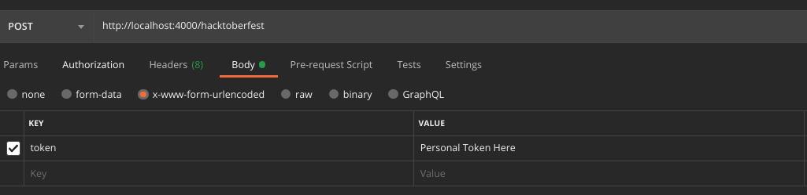

## Hacktoberfest 2020 Validation Checker 
### Introduction

An API to simulate DigitalOcean's Hacktoberfest Validation Check.

### Step to Use the API

- Make a POST Request to ```http://localhost:4000/hacktoberfest``` .
- Send your PAT(Personal Access Token) in Body.  Check this [link](https://github.com/settings/tokens) to get your PAT.
## Example 
### Request
  

### Response
If completed,
`{ 
    success:true   
}`   
else `{ 
    success:false
}`   


References: [Official Digital Ocean's Repository](https://github.com/digitalocean/hacktoberfest)

Special Thanks to [@fridaland](https://github.com/fridaland) and [@MattIPv4](https://github.com/MattIPv4)
